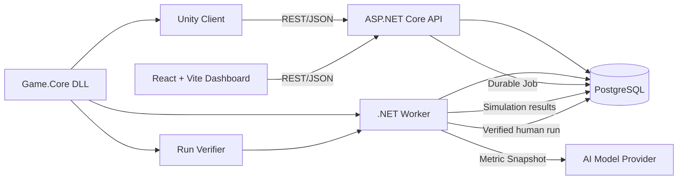
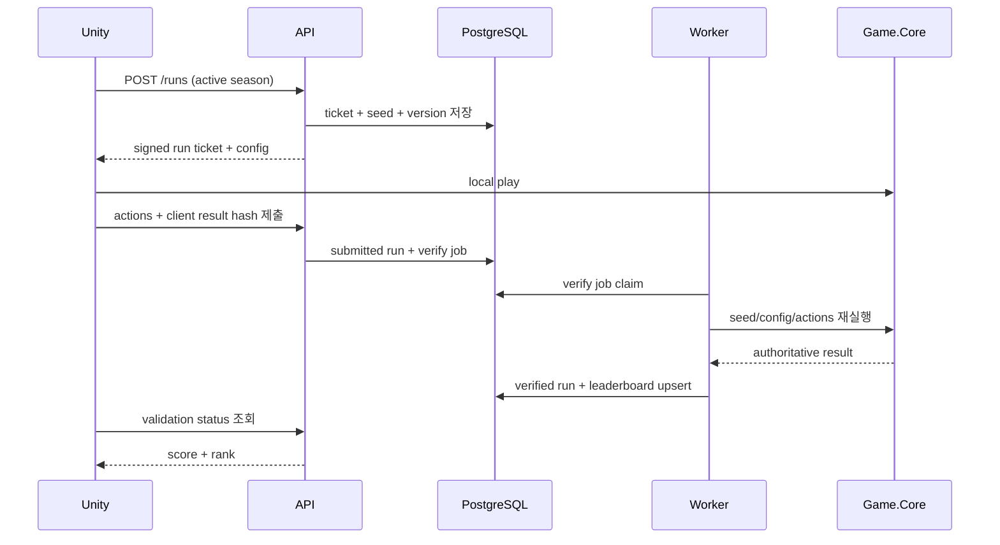
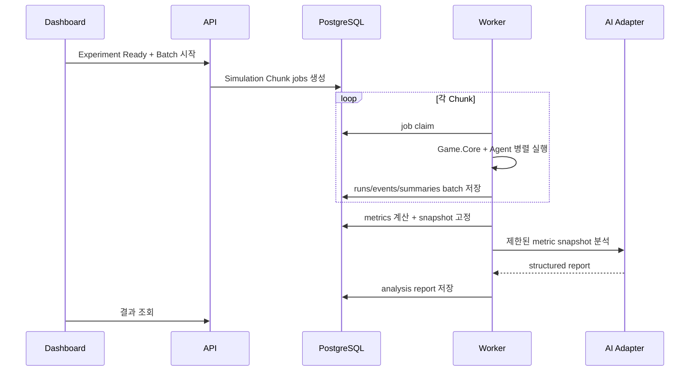

# 아키텍처 설계

클라이언트 확장: [ADR-0015](decisions/0015-web-prototype.md)의 Unity WebGL은 기존 API·Worker·PostgreSQL 구조를 그대로 사용한다. Web 게임 호스트는 정적 파일과 플레이어용 `/api` 프록시만 제공한다. [구현 기록](implementation/web-prototype.md) 참고.

상태: 확정

이 문서는 [기술 의사결정 워크숍](09-decision-workshop.md)과 승인된 [ADR](decisions/README.md)을 반영한 구현 기준이다.

## 1. 설계 목표

- 하나의 결정론적 Game Core를 Unity, 시뮬레이션, 서버 검증에서 공유한다.
- 개발·배포 복잡도를 낮추면서 책임 경계를 코드 수준에서 분리한다.
- 합성 실험의 대량 실행과 인간 Run 검증을 비동기 처리한다.
- 모든 결과를 버전과 시드로 재현한다.
- AI의 분석 권한과 운영 변경 권한을 분리한다.
- 실제 병목이 확인되기 전 메시지 브로커, 캐시, 분석 DB를 도입하지 않는다.

## 2. 아키텍처 스타일

MVP는 `모듈형 모놀리스 API + 별도 Worker + 단일 PostgreSQL`로 구성한다.

- API는 기능별 모듈을 한 배포 단위에 둔다.
- 장시간 작업은 Worker가 내구성 있는 Job을 가져가 처리한다.
- API와 Worker는 같은 Application/Domain 코드를 공유한다.
- Dashboard와 Unity는 API만 사용하고 DB에 직접 접근하지 않는다.
- 기능 경계가 충분히 안정되고 독립 확장 필요가 측정되면 서비스 분리를 검토한다.

마이크로서비스를 먼저 사용하지 않는 이유:

- 개인 프로젝트에서 네트워크·배포·분산 트랜잭션 비용이 핵심 가치보다 커진다.
- 현재 독립 확장이 필요한 트래픽 근거가 없다.
- 모듈 경계, 비동기 Job, 관측성을 통해 설계 역량은 충분히 증명할 수 있다.

## 3. 전체 구성



## 4. 기술 기준

| 영역 | 선택 | 이유 |
|---|---|---|
| Game Client | Unity 6.3 LTS / C# | 장기 지원되는 Unity 기준, 기존 전문성 활용 |
| Shared Game Core | .NET Standard 2.1 class library | Unity와 최신 .NET에서 공통 참조 가능 |
| Backend API | ASP.NET Core on .NET 10 LTS | C# 도메인 공유, 장기 지원, 웹·Worker 생태계 |
| Background Worker | .NET 10 Worker Service | 시뮬레이션·검증·집계 작업 분리 |
| Database | PostgreSQL 18.x | 관계형 제약, JSONB, 트랜잭션, 분석 SQL |
| Dashboard | React + Vite SPA / TypeScript | 별도 API와 책임이 분명한 운영 UI |
| Local Runtime | Docker Compose | API, Worker, Dashboard, DB 재현 |
| Observability | OpenTelemetry + structured logging | 요청·Job·실험의 상관 추적 |
| AI | Provider-neutral adapter | 특정 모델 종속 최소화 |

정확한 patch 버전은 구현 시점의 최신 보안 패치로 고정한다. 현재 선택 근거:

- Unity 6.3 LTS는 2027년 12월까지 LTS 지원된다: [Unity release support](https://unity.com/releases/unity-6/support)
- Unity의 기본 API 호환 수준은 .NET Standard 2.1이다: [Unity .NET profile support](https://docs.unity3d.com/kr/6000.0/Manual/dotnet-profile-support.html)
- .NET 10은 2028년 11월까지 지원되는 Active LTS다: [.NET support policy](https://dotnet.microsoft.com/en-us/platform/support/policy)
- PostgreSQL 18은 2030년 11월까지 지원된다: [PostgreSQL versioning policy](https://www.postgresql.org/support/versioning/)
- Vite는 정적 SPA build와 개발 서버를 제공한다: [Vite guide](https://vite.dev/guide/)

## 5. 저장소 구조

```text
/
├─ apps/
│  ├─ unity-client/                 # Unity 프로젝트
│  └─ dashboard/                    # React + Vite 운영 SPA
├─ src/
│  ├─ SimOps.Game.Core/             # 순수 결정론적 규칙
│  ├─ SimOps.Game.Contracts/        # 공유 DTO와 버전 계약
│  ├─ SimOps.Api/                   # ASP.NET Core host
│  ├─ SimOps.Application/           # Use case와 port
│  ├─ SimOps.Domain/                # 실험·설정·시즌 도메인
│  ├─ SimOps.Infrastructure/        # PostgreSQL, AI, auth adapter
│  └─ SimOps.Worker/                # 비동기 Job host
├─ tests/
│  ├─ Game.Core.UnitTests/
│  ├─ Application.UnitTests/
│  ├─ IntegrationTests/
│  ├─ DeterminismTests/
│  └─ EndToEndTests/
├─ packages/
│  └─ com.simops.game-core/         # Unity용 관리 DLL 패키지
├─ infra/
│  ├─ compose.yaml
│  └─ migrations/
└─ docs/
```

## 6. Game.Core

### 6.1 책임

- GameState 생성과 상태 전이
- 행동 유효성 판정
- 전투, 보상 후보, 결과 계산
- 시드와 서브시드 파생
- 점수 계산에 필요한 결과 생성
- canonical result hash 생성

### 6.2 금지 의존성

- UnityEngine 타입
- 네트워크, 파일, DB
- 현재 시각과 전역 난수
- 프레임 순서
- 환경별 locale
- 순서가 보장되지 않은 collection 순회에 의존하는 계산

### 6.3 결정론 정책

- 전투 수치는 정수 또는 명시적인 fixed-point 규칙으로 계산한다.
- float 기반 물리나 플랫폼별 수학 결과에 게임 판정을 의존하지 않는다.
- RNG 알고리즘과 Seed 파생 함수를 Game Version에 고정한다.
- encounter, intent, reward, agent RNG stream을 분리한다.
- 컬렉션 처리 순서를 명시적으로 정렬한다.
- 최종 상태를 canonical serialization 후 hash한다.

### 6.4 Unity 공유 방식

`SimOps.Game.Core`는 `netstandard2.1`로 빌드한다.

- Backend와 Worker는 ProjectReference로 사용한다.
- Unity는 동일 빌드 산출물을 관리 DLL 패키지로 사용한다.
- CI가 DLL checksum과 Game Version 메타데이터를 함께 생성한다.
- Unity에 포함된 checksum과 서버 활성 checksum이 다르면 랭킹 Run 시작을 거부한다.

## 7. Unity Client

### 책임

- 사람 입력과 게임 표현
- PC·모바일별 입력, 화면, 기기 생명주기 Adapter
- 활성 시즌·설정 조회
- Run Ticket 요청
- Game Core에 행동 전달
- 행동 로그와 로컬 텔레메트리 버퍼 생성
- Run 제출과 검증 상태 표시
- 자신의 Run 또는 공개 리플레이 재생

### 비책임

- 최종 점수 확정
- 랭킹 순위 계산
- 운영 설정 승인
- 신뢰 가능한 결과 판정

### 네트워크 실패

- 진행 중 Run과 행동 로그를 로컬에 저장한다.
- 제출은 idempotency key와 함께 재시도한다.
- Ticket 만료 후에는 로컬 플레이 결과를 볼 수 있지만 공개 랭킹에는 등록하지 않는다.

### 멀티플랫폼 경계

- 하나의 Unity 프로젝트와 공통 Scene·Prefab·Game Core를 사용한다.
- PC와 모바일은 플랫폼별 Build Profile과 얇은 Adapter만 분리한다.
- 키보드·마우스와 터치는 같은 `GameAction`으로 변환한다.
- Safe Area, 화면비, DPI, pause·resume, 로컬 저장 경로는 Game Core 밖에서 처리한다.
- MVP 대상은 Windows·Android, 화면은 가로 고정이며 itch.io로 배포한다.

## 8. Backend API 모듈

하나의 ASP.NET Core host 안에서 다음 모듈을 분리한다.

### Identity

- 익명 플레이어 발급과 credential hash 검증
- 운영자 인증과 역할

### Seasons

- 활성 시즌과 공개 설정 조회
- 시즌 생성·종료

### Runs

- Run Ticket 발급
- 행동 로그 제출
- 검증 상태와 리플레이 조회

### Leaderboards

- 상위, 내 주변, 개인 최고 기록 조회
- 종료 시즌 snapshot 조회

### Configs

- 설정 초안, 스키마 검증, 승인
- immutable version과 checksum
- 배포·롤백 요청

### Experiments

- 가설, Variant, 판정 기준
- Simulation Batch 요청
- 진행률과 결과 조회

### Analytics

- 고정된 metric query와 집계 결과
- 대시보드용 분포·퍼널

### Analysis

- Metric Snapshot 생성
- AI 보고서 요청과 조회

각 모듈은 자신의 Application port를 통해서만 다른 모듈 기능을 호출한다. DB 테이블을 모듈 밖에서 임의 갱신하지 않는다.

## 9. Worker와 내구성 있는 Job

### 9.1 Job 종류

- `verify_human_run`
- `execute_simulation_chunk`
- `aggregate_experiment_metrics`
- `generate_ai_analysis`
- `expire_run_ticket`
- `apply_retention_policy`

### 9.2 Job 저장

MVP는 PostgreSQL `jobs` 테이블을 사용한다.

- 상태: queued, claimed, completed, failed, dead
- available_at, attempts, max_attempts
- worker_id, claimed_at, heartbeat_at
- payload JSONB와 idempotency key

Worker는 `FOR UPDATE SKIP LOCKED` 방식으로 Job을 claim한다. 처리는 at-least-once이므로 도메인 쓰기는 unique key와 transaction으로 idempotent하게 만든다.

### 9.3 Simulation Chunk

18,000개 Run을 각각 Job으로 만들지 않고 기본 100개 Seed 묶음을 하나의 Chunk로 사용한다.

```text
6 Agents × 3 Variants × 10 Chunks
= 180 Simulation Jobs
```

- Worker는 CPU 코어 수에 맞춰 Chunk 내부 Run을 제한된 병렬도로 실행한다.
- 결과와 이벤트는 batch insert한다.
- Chunk 실패 시 완료된 unique Run은 유지하고 누락 Seed만 재시도한다.

### 9.4 분리 기준

다음 조건에서 PostgreSQL Job을 메시지 브로커로 교체하는 것을 검토한다.

- 여러 Worker가 DB claim 경합으로 처리량 목표를 지속적으로 달성하지 못함
- Job backlog와 API 트랜잭션이 서로 영향을 줌
- 독립적인 재시도·우선순위·지연 큐 요구가 복잡해짐

## 10. 핵심 실행 흐름

### 10.1 인간 Run과 랭킹



### 10.2 합성 실험



### 10.3 설정 배포

```text
Draft 생성
→ JSON Schema + domain validation
→ 필수 Simulation 연결
→ 운영자 승인
→ 현재 시즌 종료 예약
→ 승인 Config로 새 시즌 생성
→ Unity가 새 Run 시작 시 새 설정 조회
```

MVP에서 시즌 중 공개 Config를 교체하지 않는다. 긴급 롤백도 이전 Config를 사용하는 새 시즌으로 처리한다.

## 11. API 규칙

- 외부 API는 REST/JSON으로 시작한다.
- 버전 prefix는 `/api/v1`을 사용한다.
- 쓰기 요청은 `Idempotency-Key`를 지원한다.
- Run·Batch·Analysis처럼 오래 걸리는 작업은 `202 Accepted + resource URL`을 반환한다.
- 오류는 code, message, retryable, correlationId를 포함한다.
- 시간은 UTC ISO 8601, 식별자는 UUID, 버전은 문자열로 전달한다.
- Unity와 Dashboard가 DB entity를 직접 공유하지 않고 API DTO만 사용한다.

## 12. 인증과 권한

### 플레이어

- 최초 실행 시 익명 credential 발급
- 서버에는 credential hash만 저장
- Run Ticket은 플레이어, 시즌, 시드, 만료, nonce에 바인딩

### 운영자

- ASP.NET Core Identity 기반 계정
- MVP 역할: viewer, operator, approver, admin
- 설정 승인·시즌 생성·롤백은 approver 이상
- AI Adapter credential은 Worker만 접근

### 신뢰 경계

- Unity와 Dashboard는 신뢰하지 않는 외부 클라이언트다.
- API는 입력 스키마와 권한을 검증한다.
- Worker는 내부 프로세스지만 결과 쓰기에도 DB 제약과 idempotency를 적용한다.
- AI 모델 출력은 신뢰하지 않는 제안 데이터다.

## 13. AI 분석 경계

API 또는 Worker가 다음 구조의 도구만 제공한다.

- `get_experiment_definition`
- `get_metric_snapshot`
- `get_guardrail_violations`
- `get_representative_runs`

AI는 임의 SQL, 원시 credential, 설정 배포 API를 사용할 수 없다.

출력은 자유 텍스트만 저장하지 않고 다음 구조를 검증한다.

```json
{
  "summary": "...",
  "findings": [
    {
      "claim": "...",
      "metricKeys": ["novice.stage_3_pass_rate"],
      "confidence": "medium"
    }
  ],
  "guardrails": [],
  "nextExperiment": {
    "hypothesis": "...",
    "changes": []
  }
}
```

## 14. 관측성

### 공통

- 모든 HTTP 요청, Job, Experiment, Batch, Run에 correlation ID를 연결한다.
- JSON structured log를 사용한다.
- 비밀값과 행동 payload 전체를 기본 로그에 출력하지 않는다.

### 주요 메트릭

- API request rate, error rate, p50/p95 latency
- Job queue depth, claim delay, retry, dead job
- simulation runs/sec, chunk duration
- verification duration, rejection code count
- event batch insert duration
- DB connection과 slow query
- AI call latency, token/cost, schema failure

### Health

- API liveness/readiness
- Worker heartbeat
- PostgreSQL connectivity
- migration version
- 활성 Game Core checksum

## 15. 오류와 복구

| 실패 | 처리 |
|---|---|
| Unity 제출 중 네트워크 오류 | 같은 idempotency key로 재시도 |
| Ticket 만료 | 랭킹 제외, 로컬 결과 유지 |
| Worker 중단 | heartbeat 만료 후 Job 재claim |
| Chunk 부분 실패 | unique Run 유지, 누락 Seed 재시도 |
| 이벤트 중복 | run_id + sequence unique로 무시 |
| AI 호출 실패 | 지표 결과 유지, AI Job만 재시도 |
| 설정 검증 실패 | Draft 유지, 배포 상태 전이 금지 |
| 배포 후 문제 | 시즌 종료 후 이전 Config로 새 시즌 |

## 16. 로컬과 배포

### 로컬

Docker Compose:

- PostgreSQL
- API
- Worker
- Dashboard
- 선택적 OpenTelemetry Collector

Unity Editor와 대상 PC·모바일 Development Build는 로컬 API에 연결한다. 실제 모바일 기기에서는 개발 호스트의 접근 가능한 주소와 개발용 인증서를 사용한다.

### 첫 공개 배포

- Game Client: itch.io의 Windows ZIP·Android APK
- Dashboard: GitHub Pages 정적 배포
- API: Render Free Web Service의 Docker 배포
- Worker: 인증된 wake·health endpoint만 노출하는 별도 Render Free Web Service
- DB: Neon Free PostgreSQL
- CI: 공개 저장소의 표준 GitHub Actions runner
- HTTPS termination과 비밀 관리

월 비용 0원과 결제 카드 미등록을 고정 제약으로 둔다. Cold Start와 제한된 uptime을 허용하고, 무료 정책은 실제 배포 직전에 다시 확인한다. 상세 제약은 [ADR-0013](decisions/0013-deployment-and-ci.md)을 따른다.

## 17. 성능 목표 초안

| 항목 | MVP 목표 |
|---|---|
| 활성 시즌·설정 조회 | p95 300ms 이하 |
| 랭킹 상위 100 조회 | p95 500ms 이하 |
| 인간 Run 제출 접수 | p95 500ms 이하, 검증은 비동기 |
| 인간 Run 검증 | p95 2초 이하 |
| 합성 시뮬레이션 | 개발 장비에서 초당 100 Run 이상을 초기 목표 |
| 18,000 Run 실험 | 개발 장비에서 5분 이내를 도전 목표 |
| 재현 불일치 | 검증 세트 0건 |

성능 목표는 첫 프로토타입 측정 후 조정하며 하드웨어와 측정 조건을 함께 기록한다.

## 18. 확장 경로

### 단계 1: MVP

- 단일 API, Worker 1개, PostgreSQL 1개
- 규칙 기반 Agent
- Postgres Job과 집계

### 단계 2: 사용량 증가

- Worker 수평 확장
- read-heavy Dashboard query의 사전 집계
- 이벤트 파티셔닝
- 선택적 object storage에 오래된 리플레이 이동

### 단계 3: 다중 게임·ML

- Game Adapter와 버전별 Verifier registry
- Python ML training service
- 별도 분석 저장소
- 메시지 브로커

각 단계는 측정된 병목이나 제품 요구가 있을 때만 진행한다.

## M8 구현 경계

Game Core를 바꾸지 않고 별도 .NET Standard 2.1 `SimOps.Game.Transport`로 시즌 Config Snapshot을 공유한다. Unity와 Runner는 특정 시즌 Snapshot을 검증해 Core에 주입하며 Worker도 같은 등록 Config를 로드한다. 게시·롤백은 API의 짧은 DB 트랜잭션이고 대량 실행·분석은 계속 Worker 책임이다. 승인자 키와 불변 사람 판정이 모두 있어야 게시할 수 있다. [M8 구현 기록](implementation/milestone-08-liveops.md)에 잠금·실패·호환성 경계를 정리했다.
