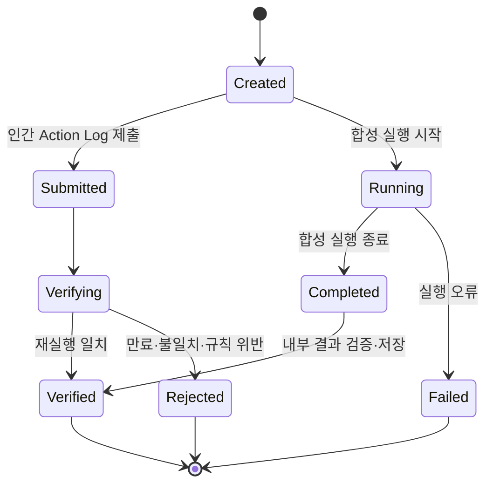
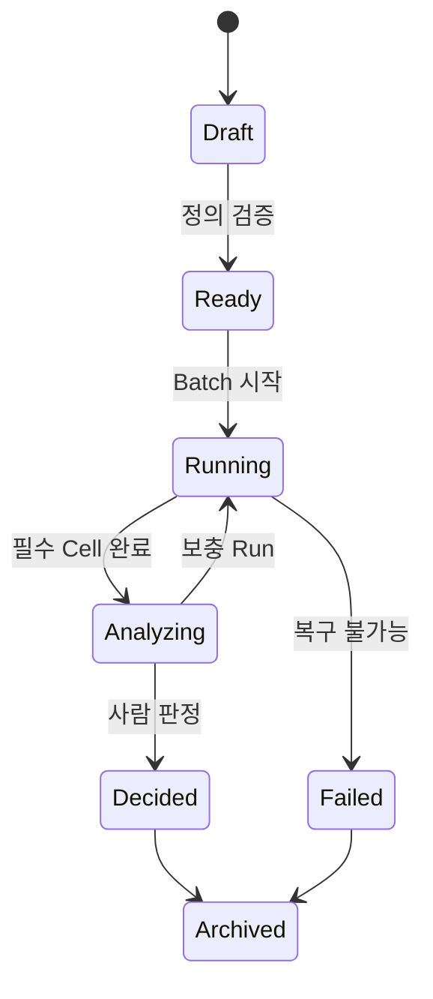
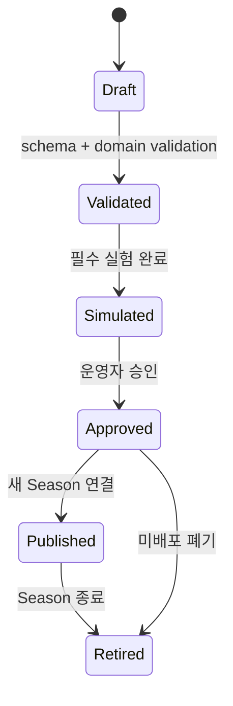
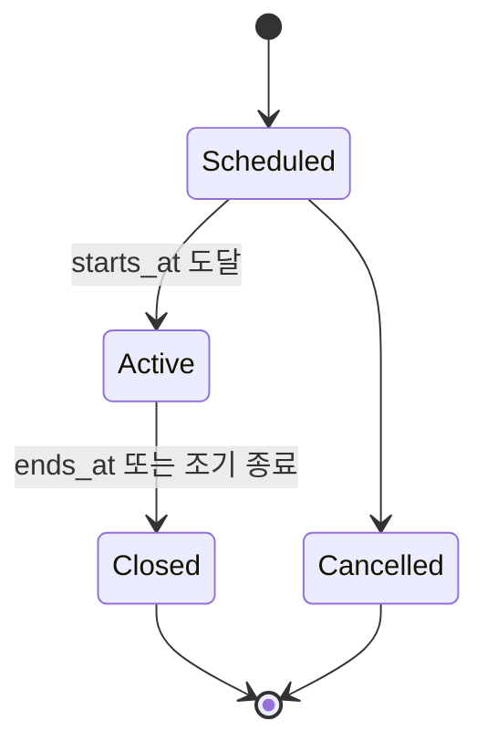
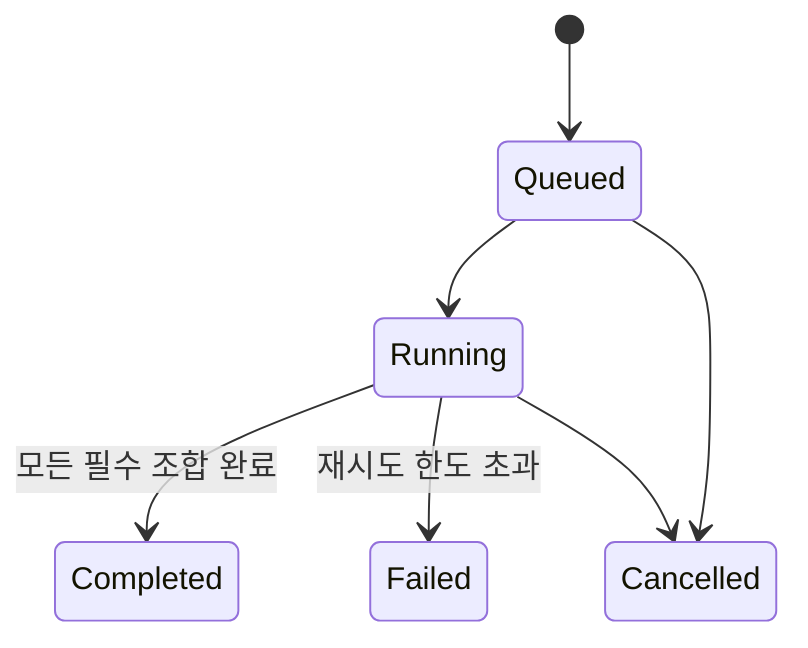

# 상태 전이 명세

상태: 확정

## Run

규칙:

- RUN-001: terminal 상태는 Verified, Rejected, Failed다.
- RUN-002: terminal 상태에서 다른 상태로 이동할 수 없다.
- RUN-003: 인간 Run만 Submitted와 Verifying을 사용한다.
- RUN-004: 합성 Run만 Running과 Completed를 사용한다.
- RUN-005: Leaderboard 갱신은 Verified 인간 Run 전이와 같은 트랜잭션에서 처리한다.

## Experiment

규칙:

- EXP-001: Ready 이후 가설, Variant, 판정 규칙은 변경할 수 없다.
- EXP-002: 필수 Cell의 목표 Run이 충족돼야 Analyzing으로 이동한다.
- EXP-003: AI Report 생성은 Decided 전 필수가 아니며, 계산된 Metric은 필수다.
- EXP-004: Decided에는 approved_candidate, rejected, rerun 중 하나의 결론이 필요하다.

## Game Config

규칙:

- CFG-001: Validated 이후 content는 불변이다.
- CFG-002: 수정은 새 Version과 parent_config_id로 표현한다.
- CFG-003: Published Config는 정확히 하나 이상의 Publication 이력을 가진다.
- CFG-004: MVP에서 Published Config 교체는 새 Season으로 처리한다.

## Season

규칙:

- SEASON-001: MVP에서 동시에 Active인 공개 Season은 하나다.
- SEASON-002: Season의 Game, Config, Score Rule FK는 생성 후 변경하지 않는다.
- SEASON-003: Closed Season의 Leaderboard는 동결한다.

## Simulation Batch

규칙:

- BATCH-001: 같은 Batch의 Variant, Agent, Seed 조합은 한 번만 완료 처리한다.
- BATCH-002: 재시도는 누락 또는 실패 조합만 대상으로 한다.
- BATCH-003: Cancelled Batch의 완료 Run은 감사·디버깅을 위해 유지할 수 있지만 최종 Metric에는 기본 포함하지 않는다.
